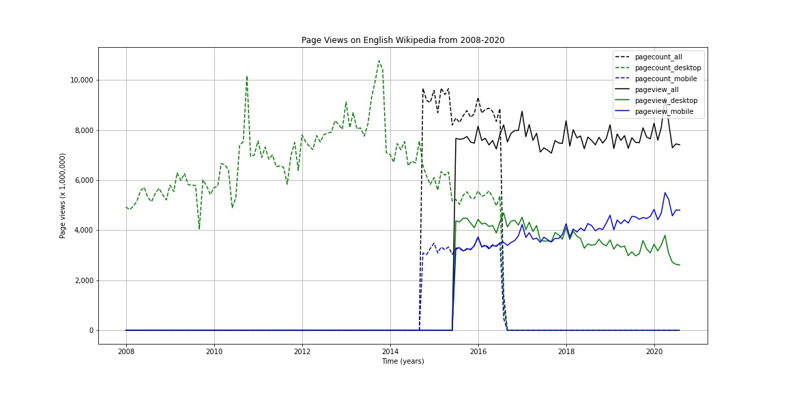

## A1: Data Curation

The goal of this project is to construct, analyze and publish a dataset of monthly traffic on English Wikipedia from January 1st 2008 to September 30 2020. All analysis is performed and documented in a single [jupyter notebook](./hcds_a1_data_curation.ipynb) including data acquisition, processing and analysis. The project aims to follow the best practices for open scientific research in designing and implementing a project that is fully reproducible by others.

### Folder Structure

```
.
├── README.md
├── data
│   ├── clean
│   │   └── en-wikipedia_traffic_200801-202009.csv
│   └── raw
│       ├── pagecounts_desktop-site_200801-201608.json
│       ├── pagecounts_mobile-site_200801-201608.json
│       ├── pageviews_desktop-site_201507-202009.json
│       ├── pageviews_mobile-app_201507-202009.json
│       └── pageviews_mobile-site_201507-202009.json
├── hcds_a1_data_curation.ipynb
└── english-wikipedia-views-2008-2020.jpg
```

### Data
All the raw data is stored under [data/raw](./data/raw) and the cleaned data is stored under [data/clean](./data/clean)

#### Source
The data is collected from two of the Wikimedia REST API's. 
- The Legacy Pagecounts API ([documentation](https://wikitech.wikimedia.org/wiki/Analytics/AQS/Legacy_Pagecounts), [endpoint](https://wikimedia.org/api/rest_v1/#!/Pagecounts_data_(legacy)/get_metrics_legacy_pagecounts_aggregate_project_access_site_granularity_start_end)) provides access to desktop and mobile traffic data from December 2007 through July 2016.

- The Pageviews API ([documentation](https://wikitech.wikimedia.org/wiki/Analytics/AQS/Pageviews), [endpoint](https://wikimedia.org/api/rest_v1/#!/Pageviews_data/get_metrics_pageviews_aggregate_project_access_agent_granularity_start_end)) provides access to desktop, mobile web, and mobile app traffic data from July 2015 through last month.

#### Data Decription

The final cleaned data is stored [here](./data/clean/en-wikipedia_traffic_200801-202009.csv)
The fields in this file represent the following
  
  | Column  | Value | Description|
|--------------|-------------|---------------|
| year | YYYY | year in YYYY format |
| month | MM | month in MM format |
| pagecount_all_views | num_views |  The total number of pagecounts (mobile + desktop)|
| pagecount_desktop_views | num_views | The number of desktop pagecounts |
| pagecount_mobile_views | num_views | The number of mobile pagecounts|
| pageview_all_views | num_views | The total number of pageviews (mobile + desktop)|
| pageview_mobile_views | num_views | The number of mobile pageviews (mobile-app + mobile-web)|
| pageview_desktop_views | num_views | The number of desktop pageviews |

#### Data issues

The data from the Pageview API excludes spiders/crawlers, while data from the Pagecounts API does not. Since, we are only interested in organic traffic, the number of pagecounts may be higher.

### Methodology

#### Step 1: Data Acquisition

Data is collected by making API requests to Wikimedia endpoints and storing the raw output in JSON formatted files. Data pertaining to desktop and mobile traffic is collected by making separate API calls to the endpoint, setting desired parameters.

#### STep 2: Data Processing

The desktop and mobile views are combined to get the total number of views for both Pagecounts and Pageviews. All 5 JSON files are combined to produce a final cleaned csv file having columns for month, year and counts for three traffic metrics: mobile traffic, desktop traffic, and all traffic (mobile + desktop) for both Pagecounts and Pageviews.

#### Step 3: Data Analysis

We plot a timeseries graph for the three traffic metrics from January 1 2008 to September 30 2020 with different line styles (to separate pagecounts from pageviews) and colors (to separate the three tarffic metrics, i.e., mobile, desktop and total)



### Python libraries
  
Following Python libraries were utilized
- [requests](https://pypi.org/project/requests/2.7.0/) - To perform API requests
- [json](https://docs.python.org/3/library/json.html) - To decode and encode JSON
- [pandas](https://pandas.pydata.org/) - Python data processing library
- [matplotlib](https://matplotlib.org/) - Data plotting tool 


### Terms of Use

The source data is taken from Wikimedia. By using this repository you agree to Wikimedia [Terms of Use](https://www.mediawiki.org/wiki/Wikimedia_REST_API#Terms_and_conditions)

The code is available under [MIT License](../LICENSE)
